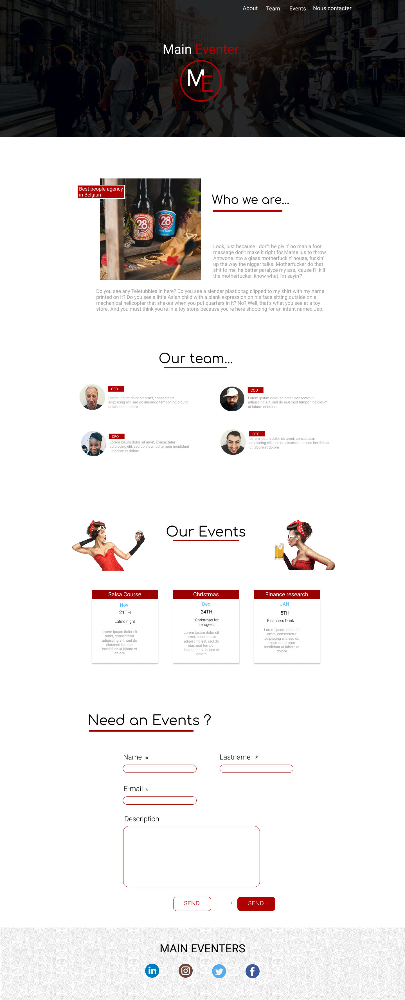

# Projet Main Eventer

**Collaborators**: 

* [Meilyn ANDRADE](https://github.com/Meilyn)
* [Amine NACHIT](https://github.com/webmaster83)
* [Cedric VAN HOVE](https://github.com/cevaho)
* [Othman MOULILA](https://github.com/luffy1140/)

**When** : January 2019

**Where**: BeCode

**Formation**: Junior Web Developper

## Objectives

* Learn on the basis of realistic demands.
* HTML & CSS integrations in one page skill.
* Learn working in team.
* Live the design stages of a one page project.
* Learn how to manage a project with different methodology.

## Work Distribution 

**@Othman** : Menu & Header
**@Meilyn** : About | Our Team | footer
**@Cedric** : Events
**@Amine** : Contact Form

## Projet 

We are a brand new web development company and we landed our first customer.

## Mock Up 

